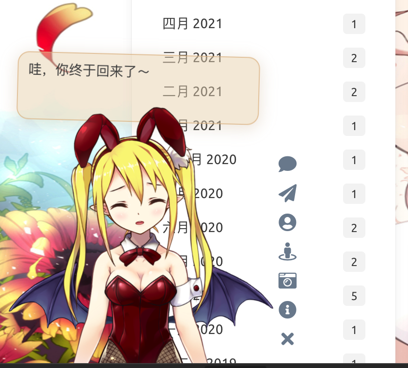
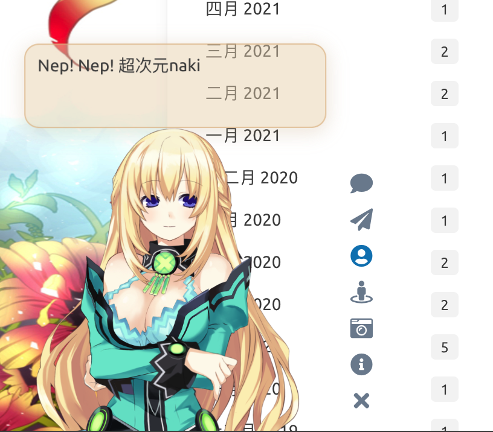
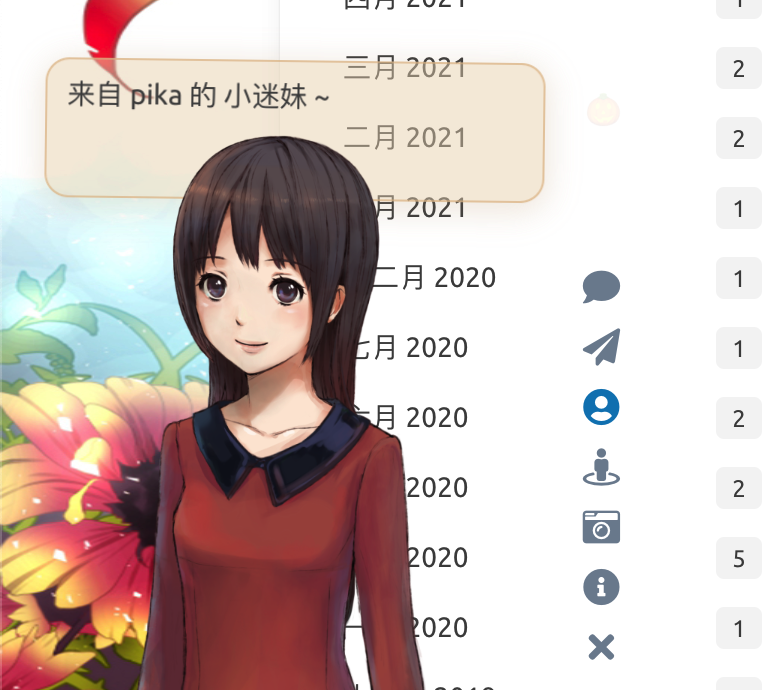

# Live2D Widget

本仓库根据[stevenjoezhang](https://github.com/stevenjoezhang/live2d-widget)改动而来，原项目部分模型皮肤展示不全，此项目还加入几个新的角色模型。

<!-- 
 -->

## 特性 Feature

在网页中添加 Live2D 看板娘。兼容 PJAX，支持无刷新加载。  
Add Live2D widget to web page. Compatible with PJAX.

**警告：本项目使用了大量 ES6 语法，不支持 IE 11 等老旧浏览器。**  
**WARNING: This project does not support legacy browsers such as IE 11.**

## Demo

在[pika的博客](https://itpika.com)的可查看效果。鼠标点击人物时，部分人物带有语言互动。





## 依赖 Dependencies

本插件需要 Font Awesome (v4 或 v5) 图标支持，请确保相关样式表已在页面中加载。以 Font Awesome v4 为例，请在 `<head>` 中加入：  
Font Awesome (v4 or v5) is required for this plugin. Take Font Awesome v4 as an example, please add the following in `<head>`:
```xml
<link rel="stylesheet" href="https://cdn.jsdelivr.net/npm/font-awesome/css/font-awesome.min.css">
```
否则图标将无法正常显示。（如果网页中已经加载了任何版本的 Font Awesome，就不要重复加载了）

## 使用 Usage

将这一行代码加入 `<head>` 或 `<body>`，即可展现出效果：
```xml
<script src="./live2d/autoload.js"></script>
```

如果网站启用了 PJAX，由于看板娘不必每页刷新，因此要注意将相关脚本放到 PJAX 刷新区域之外。

换句话说，如果你是小白，或者只需要最基础的功能，就只用把这一行代码，连同前面加载 Font Awesome 的一行代码，一起放到 html 的 `<head>` 中即可。  
对于用各种模版引擎（例如 Nunjucks，Jinja 或者 PHP）生成的页面，也要自行修改，方法类似，只是可能略为麻烦。以 [Hexo](https://hexo.io) 为例，需要在主题相关的 ejs 或 njk 模版中正确配置路径，才可以加载。


此项目基于我自己的静态博客修改而来，不能直接开箱即用，建议自己拷贝一份DIY。我们强烈推荐自己进行配置，否则很多功能是不完整的，并且可能产生问题！**  
如果你有兴趣自己折腾的话，请看下面的详细说明。

你也可以直接把这些角色资源文件放到自己服务器上。或者使用上一个作者的提供的CDN。再次说明，本项目基于原作者的项目修改而来。自己目前并不打算将它做得像原作者一样的开箱即用，如果喜欢此项目某些角色，自取便可。


## 后端 API

`initWidget` 方法接受名为 `apiPath` 和 `cdnPath` 的参数，两者设置其中一项即可。其中 `apiPath` 为后端 API 的 URL，可以自行搭建，并增加模型（需要修改的内容比较多，此处不再赘述）。而 `cdnPath` 则是通过 jsDelivr 这样的 CDN 服务加载资源，更加稳定。

## 目录结构 Files

- `waifu-tips.js` 包含了按钮和对话框的逻辑；
- `waifu-tips.json` 中定义了触发条件（`selector`，CSS 选择器）和触发时显示的文字（`text`）；
- `waifu.css` 是看板娘的样式表。

源文件是对 Hexo 的 [NexT 主题](http://github.com/next-theme/hexo-theme-next)有效的，为了适用于你自己的网页，可能需要自行修改，或增加新内容。  
**警告：作者不对包括但不限于 `waifu-tips.js` 和 `waifu-tips.json` 文件中的内容负责，请自行确保它们是合适的。**

如果有任何疑问，欢迎提 Issue。如果有任何修改建议，欢迎提 Pull Request。

点击看板娘的纸飞机按钮时，会出现一个彩蛋，这来自于 [WebsiteAsteroids](http://www.websiteasteroids.com)。

## 更多 More

更多内容可以参考：  
https://imjad.cn/archives/lab/add-dynamic-poster-girl-with-live2d-to-your-blog-02  
https://github.com/xiazeyu/live2d-widget.js  
https://github.com/summerscar/live2dDemo

关于后端 API 模型：  
https://github.com/fghrsh/live2d_api  
https://github.com/xiazeyu/live2d-widget-models  
https://github.com/xiaoski/live2d_models_collection

除此之外，还有桌面版本：  
https://github.com/amorist/platelet  
https://github.com/akiroz/Live2D-Widget  
https://github.com/zenghongtu/PPet  
https://github.com/LikeNeko/L2dPetForMac

以及 Wallpaper Engine：
https://github.com/guansss/nep-live2d

本仓库并不包含任何模型，用作展示的所有 Live2D 模型、图片、动作数据等版权均属于其原作者，仅供研究学习，不得用于商业用途。

Live2D 官方网站：  
https://www.live2d.com/en/  
https://live2d.github.io

Live2D Cubism Core は Live2D Proprietary Software License で提供しています。  
https://www.live2d.com/eula/live2d-proprietary-software-license-agreement_en.html  
Live2D Cubism Components は Live2D Open Software License で提供しています。  
http://www.live2d.com/eula/live2d-open-software-license-agreement_en.html

> The terms and conditions do prohibit modification, but obfuscating in `live2d.min.js` would not be considered illegal modification.

https://community.live2d.com/discussion/140/webgl-developer-licence-and-javascript-question

